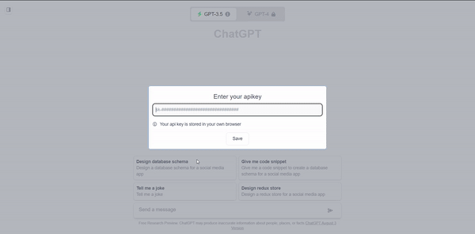

# ChatGPT

ChatGPT clone with added features

# Deploy

[](https://vercel.com/new/clone?repository-url=https%3A%2F%2Fgithub.com%2FPrasadBroo%2FChatGPT&install-command=npm%20install&output-directory=dist)
[](https://app.netlify.com/start/deploy?repository=https://github.com/PrasadBroo/ChatGPT)

# Demo



## Features

- Multiple chats completions simultaneously😲
- Send chat with/without history 🧐
- Choose model from a variety of GPT-3/GPT-4 models 😃
- Stores your chats in local storage 👀
- Same user interface as the original ChatGPT 📺
- Custom chat titles 💬
- Export/Import your chats 🔼🔽

## To-Do

- [x] Add DALL-E1 & DALL-E2 Image Generation Models
- [x] Add Code Highlight
- [ ] [Add ChatGPT Pre Made Prompts](https://github.com/f/awesome-chatgpt-prompts)
## Requirements

- Node JS
- npm
- [Create Open AI account](https://beta.openai.com/signup/)

## Setup

1. Clone the repository

```
git clone https://github.com/PrasadBroo/ChatGPT.git
```

2. Install client dependencies

```
cd ChatGPT
npm install
```

3. Get your Open AI API key from [Open AI API Key](https://platform.openai.com/account/api-keys)

## Usage

1. Start the app

```
npm run dev
```

## Contribution

All contributions are welcome. Feel free to open an issue or create a pull request.

<a href="https://www.buymeacoffee.com/prasadbro" target="_blank"></a>

## Liscence

[MIT](https://github.com/PrasadBroo/ChatGPT/blob/main/LICENSE)
